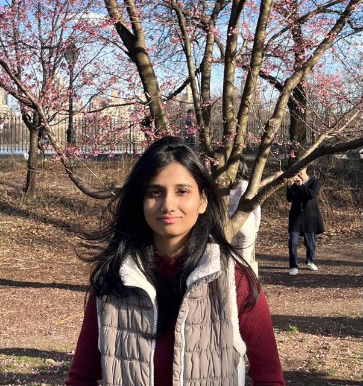

<!-- (comment) the image below can be found in img folder of this very project-->
<!--{: style="float: right; margin: 0px 20px; width: 180px;" name="fox"}-->
<!--{: style="float: right; margin: 0px 20px; width: 180px;" name="fox"}-->
{: style="float: right; margin: 0px 20px; width: 200px; border-radius: 0;" name="fox"}

I am Divya Appapogu, a second-year Ph.D. student in Computer Science at Boston University, advised by [Dr. Aaron Mueller](https://aaronmueller.github.io).

My primary research interests are in interpretable machine learning and mechanistic interpretability, all in the context of AI safety. I am currently working on methods to identify and understand multi-dimensional concepts in large language models. In the past, I have worked on multimodal models and computer vision.

Prior to starting my Ph.D., I worked as a software engineer at Barclays and OYO. A long time ago, I completed my undergraduate in Engineering Science at the Indian Institute of Technology Hyderabad.

Outside of research, I enjoy reading science fiction and traveling.

If you are interested in my work, would like to discuss ideas, or have any questions, please feel free to reach out!

**Email:** [divsp@bu.edu](mailto:divya@bu.edu)

<!--  -->

<!--__Blog-course:__    NLP Course For You - look [here](https://lena-voita.github.io/nlp_course.html).-->

## News 
__2025__
* Stay Tuned!

